# LLM-Powered Confluence Search and Q&A Tool — Technical Design

> **Version:** 1.0.0 | **Date:** February 26, 2026 | **Owner:** AI Engineering - Lorant Zsarnowszky

---

## Executive Summary

This document outlines a production-grade architecture for an LLM-powered Confluence search and Q&A system using Retrieval-Augmented Generation (RAG). The solution addresses four core challenges: maintaining up-to-date knowledge synchronization, handling multimodal attachments (images, diagrams, documents), managing multi-space context with project-specific metadata, and continuously evaluating answer quality.

**Key Technical Pillars:**
- **Real-time sync** via webhook-driven incremental ingestion pipeline
- **Multimodal RAG** supporting text, images (via vision LLMs), and document attachments
- **Space-aware retrieval** with metadata filtering and project-specific context injection
- **Automated evaluation** using LLM-as-judge + human feedback loops

---

## 1. Keeping Confluence Knowledge Accessible and Up-to-Date

### 1.1 Challenge

Confluence content evolves continuously — pages are created, updated, archived, and deleted. The RAG system must reflect the current state without manual re-indexing or stale results.

### 1.2 Solution Architecture


### 1.3 Implementation Strategy

#### Real-Time Webhook Integration

- **Confluence Webhooks**: Register webhooks for `page_created`, `page_updated`, `page_trashed`, `page_removed` events
- **Webhook Listener**: FastAPI service at `/webhooks/confluence` endpoint with signature verification (HMAC-SHA256)
- **Event Queue**: Push events to Redis Streams for async processing; prevents webhook timeout and provides retry capability

**Webhook handler pattern:**

```python
@app.post("/webhooks/confluence")
async def handle_confluence_webhook(
    request: Request,
    background_tasks: BackgroundTasks
):
    # Verify webhook signature
    signature = request.headers.get("X-Confluence-Signature")
    payload = await request.body()
    if not verify_signature(payload, signature, WEBHOOK_SECRET):
        raise HTTPException(401, "Invalid signature")
    
    event = await request.json()
    event_type = event["webhookEvent"]
    
    # Queue for async processing
    await redis.xadd(
        "confluence:events",
        {"type": event_type, "data": json.dumps(event)}
    )
    
    return {"status": "queued"}
```

#### Incremental Ingestion Worker

- **Content Extraction**: Use `atlassian-python-api` to fetch page content, metadata, and attachments via REST API
- **Change Detection**: Store content hash (SHA-256) in PostgreSQL; skip re-embedding if hash unchanged
- **Chunking Strategy**: Recursive character-based splitting with 512-token chunks, 64-token overlap; preserve Confluence page structure (headers, tables, code blocks) as metadata
- **Embedding**: Batch embed using `text-embedding-3-large` (1536 dimensions); store in Qdrant with metadata payload

**Metadata attached to every chunk:**

```json
{
  "page_id": "123456",
  "page_title": "Authentication Service Spec",
  "space_key": "ENG",
  "space_name": "Engineering",
  "author": "john.doe@company.com",
  "last_modified": "2026-02-26T08:00:00Z",
  "page_url": "https://company.atlassian.net/wiki/spaces/ENG/pages/123456",
  "labels": ["backend", "security", "api"],
  "content_hash": "a3f5b8c...",
  "parent_page_id": "112233",
  "chunk_index": 2,
  "total_chunks": 8
}
```

#### Deletion Handling

- **Soft Delete**: Mark vectors as `deleted=true` in Qdrant metadata; exclude from search via filter
- **Hard Delete**: Weekly cleanup job purges vectors marked deleted > 30 days
- **Orphan Detection**: Monthly audit detects pages in vector DB but not in Confluence; flags for review

#### Scheduled Full Reconciliation

- **Weekly Job**: Compare Confluence space inventories against vector DB; detect missed webhook events
- **Re-embedding Trigger**: If Confluence page `last_modified` > vector DB timestamp, trigger re-ingestion
- **Monitoring**: Alert if reconciliation finds > 5% drift between Confluence and vector DB

### 1.4 Sync Performance Targets

| Metric | Target |
|---|---|
| Webhook → Vector DB latency (P95) | < 30 seconds |
| New page → searchable | < 1 minute |
| Updated page → reflected in results | < 2 minutes |
| Weekly reconciliation runtime | < 2 hours |
| Change detection accuracy | > 99.5% |

---

## 2. Handling Page Attachments

### 2.1 Challenge

Confluence pages contain:
- **Images/Diagrams**: Architecture diagrams, workflow charts, screenshots, UI mockups
- **Text Documents**: PDFs, Word docs, Excel sheets, CSVs attached for reference

Standard text-only RAG cannot extract information from visual content or document attachments.

### 2.2 Solution: Multimodal RAG Pipeline


### 2.3 Image and Diagram Handling

#### Vision-Language Model Integration

- **Model Selection**: Use GPT-4o (multimodal) or Gemini 1.5 Pro for image understanding
- **Structured Extraction Prompt**:

```python
VISION_PROMPT = """
You are analyzing an image attached to a Confluence documentation page.

Generate a structured description including:
1. Image Type: [diagram, screenshot, chart, photo, mockup, other]
2. Main Components: List all visible elements (boxes, arrows, text labels, icons)
3. Relationships: Describe connections and flow between components
4. Text Content: Extract all visible text (labels, titles, annotations)
5. Purpose: Infer what this image is documenting or explaining

Be precise and technical. This description will be used for semantic search.

Image Context from Page:
Title: {page_title}
Section: {section_heading}
Caption: {image_caption}
"""
```

- **Output Example**:

```json
{
  "image_type": "architecture_diagram",
  "components": [
    "API Gateway",
    "Authentication Service",
    "User Database",
    "Redis Cache"
  ],
  "relationships": [
    "API Gateway routes requests to Authentication Service",
    "Authentication Service reads from User Database",
    "Authentication Service caches tokens in Redis"
  ],
  "extracted_text": [
    "POST /auth/login",
    "JWT Token",
    "PostgreSQL"
  ],
  "purpose": "System architecture showing authentication flow and data dependencies"
}
```

#### OCR Fallback for Text-Heavy Images

- **Tesseract OCR**: Extract text from diagrams with labels, flowcharts, annotated screenshots
- **Combine Vision + OCR**: Vision LLM provides semantic understanding; OCR ensures exact keyword matching for technical terms

#### Image Metadata Enrichment

```json
{
  "attachment_id": "att_789",
  "attachment_name": "auth-flow-diagram.png",
  "page_id": "123456",
  "image_url": "https://company.atlassian.net/.../auth-flow-diagram.png",
  "vision_description": "Architecture diagram showing...",
  "ocr_text": "API Gateway, JWT, Redis...",
  "detected_entities": ["API Gateway", "Redis", "PostgreSQL"],
  "image_type": "architecture_diagram"
}
```

### 2.4 Document Attachment Handling

#### PDF Documents

- **Text Extraction**: `PyMuPDF` (fast) or `pdfplumber` (table-aware) for text content
- **Table Extraction**: Convert tables to Markdown format; preserve structure for better retrieval
- **Metadata**: Extract title, author, creation date from PDF metadata fields

#### Word Documents (DOCX)

- **Parser**: `python-docx` extracts text, headings, tables, and embedded images
- **Preserve Structure**: Maintain heading hierarchy as metadata (`h1`, `h2`, `h3`) for context

#### Excel Sheets (XLSX)

- **Parser**: `openpyxl` reads cell values, formulas, sheet names
- **Data Structuring**: Convert sheets to Markdown tables or JSON; embed sheet-level summaries
- **Use Case**: Financial reports, data tables, configuration matrices

#### Chunking Strategy for Attachments

- **Document Chunks**: 512 tokens per chunk with 64-token overlap (same as page content)
- **Image Descriptions**: Embed as single chunk with full vision LLM description + OCR text
- **Cross-Reference**: Link attachment chunks to parent page chunks via `parent_page_id` metadata

### 2.5 Attachment Processing Performance

| Attachment Type | Processing Time (P95) | Success Rate Target |
|---|---|---|
| Images (< 5MB) | < 10 seconds | > 98% |
| PDFs (< 20 pages) | < 20 seconds | > 95% |
| DOCX (< 50 pages) | < 15 seconds | > 97% |
| XLSX (< 10 sheets) | < 10 seconds | > 99% |

---

## 3. Handling Many Different Spaces

### 3.1 Challenge

Different Confluence spaces serve different purposes:
- **Engineering Space**: Technical specs, API docs, architecture decisions
- **Product Space**: Feature requirements, user stories, roadmaps
- **HR Space**: Policies, onboarding guides, benefits documentation
- **Sales Space**: Sales playbooks, case studies, pricing sheets

Each space has unique conventions, terminology, document structures, and relevance contexts.

### 3.2 Solution: Space-Aware RAG with Contextual Metadata


### 3.3 Space Metadata Registry

#### Space Profile Storage (PostgreSQL)

```sql
CREATE TABLE confluence_spaces (
    space_key VARCHAR(50) PRIMARY KEY,
    space_name VARCHAR(255),
    space_type VARCHAR(50), -- 'engineering', 'product', 'hr', 'sales'
    description TEXT,
    conventions JSONB, -- custom conventions for this space
    primary_topics TEXT[], -- ['authentication', 'deployment', 'ci-cd']
    doc_structure_hints JSONB, -- where specs live, naming patterns
    access_groups TEXT[], -- AD groups with access
    last_updated TIMESTAMP
);
```

**Example Space Profile**:

```json
{
  "space_key": "ENG",
  "space_name": "Engineering",
  "space_type": "engineering",
  "conventions": {
    "spec_location": "All technical specs under 'Specifications' parent page",
    "decision_records": "ADRs stored with 'adr-' prefix in title",
    "code_samples": "Code blocks use Python/JavaScript/Go",
    "terminology": {
      "auth": "authentication service (OAuth2 + JWT)",
      "db": "PostgreSQL primary, Redis cache"
    }
  },
  "primary_topics": ["backend", "infrastructure", "api-design", "security"],
  "doc_structure_hints": {
    "specs_parent_page_id": "112233",
    "runbooks_parent_page_id": "445566"
  }
}
```

### 3.4 Space-Aware Retrieval Strategy

#### Query-Time Space Filtering

- **User Context**: Fetch user's accessible spaces from Confluence API or Azure AD group membership
- **Qdrant Filter**: Apply metadata filter `space_key IN ['ENG', 'PROD']` to vector search
- **Boost Relevant Spaces**: If query contains space-specific terminology (e.g., "API spec"), boost `space_type=engineering` results

**Qdrant filter example**:

```python
from qdrant_client.models import Filter, FieldCondition, MatchAny

search_filter = Filter(
    must=[
        FieldCondition(
            key="space_key",
            match=MatchAny(any=user_accessible_spaces)
        ),
        FieldCondition(
            key="deleted",
            match={"value": False}
        )
    ]
)

results = qdrant_client.search(
    collection_name="confluence_docs",
    query_vector=query_embedding,
    query_filter=search_filter,
    limit=20
)
```

#### Space-Specific Context Injection

- **Pre-Retrieval**: Inject space conventions into the LLM prompt before generating the answer
- **Example**:

```python
SPACE_CONTEXT_TEMPLATE = """
You are answering a question about the {space_name} space in Confluence.

Space Context:
- Type: {space_type}
- Primary Topics: {primary_topics}
- Document Conventions: {conventions}

When answering:
- Use terminology specific to this space
- Reference document structure conventions
- Cite page titles and URLs from this space

Retrieved Context:
{retrieved_chunks}

Question: {user_question}
"""
```

#### Cross-Space Retrieval

- **Default Behavior**: Search across all accessible spaces; rank by relevance
- **Multi-Space Results**: Group results by space in the UI; show top 3 results per space
- **Disambiguation**: If query matches multiple spaces (e.g., "authentication" in Engineering + Product), surface both and ask user to clarify

### 3.5 Space Management Operations

| Operation | Implementation | Frequency |
|---|---|---|
| **Space Profile Creation** | Admin creates profile via UI; stores in PostgreSQL | On new space creation |
| **Convention Updates** | Admin edits conventions via UI; triggers re-ranking calibration | As needed |
| **Access Sync** | Fetch user → space mappings from Confluence API | Every 6 hours |
| **Space-Level Analytics** | Track query distribution, answer quality per space | Daily aggregation |

---

## 4. Testing Answer Quality

### 4.1 Challenge

LLM-generated answers can suffer from:
- **Hallucinations**: Fabricating information not present in retrieved context
- **Irrelevance**: Answering a different question than asked
- **Incompleteness**: Missing key details from retrieved documents
- **Staleness**: Using outdated information despite having current data

Continuous evaluation is critical for maintaining user trust.

### 4.2 Evaluation Framework

```mermaid
flowchart TD
    A[RAG System Generates Answer] --> B[Automated Evaluation Layer]
    A --> C[Human Feedback Loop]
    
    B --> B1[LLM-as-Judge - GPT-4o]
    B1 --> M1[Faithfulness Score]
    B1 --> M2[Answer Relevance Score]
    B1 --> M3[Contextual Precision]
    B1 --> M4[Completeness Score]
    
    C --> C1[User Rating: 👍 / 👎]
    C --> C2[Expert Review Queue]
    
    M1 & M2 & M3 & M4 & C1 & C2 --> D[(Evaluation DB
    PostgreSQL)]
    D --> E[Weekly Quality Report]
    E --> F{Score Regression?}
    F -->|Yes| G[Trigger Improvement Loop]
    F -->|No| H[Continue Monitoring]
    
    G --> I[Prompt Engineering]
    G --> J[Retrieval Tuning]
    G --> K[Fine-tune Reranker]
```



### 4.3 Automated Evaluation Metrics

#### Using RAGAS Framework

```python
from ragas import evaluate
from ragas.metrics import (
    faithfulness,           # Is answer grounded in context?
    answer_relevancy,       # Is answer relevant to question?
    context_precision,      # Are retrieved docs relevant?
    context_recall,         # Did we retrieve all needed info?
    answer_correctness      # Compare against ground truth
)

# Evaluation dataset structure
eval_data = {
    "question": ["How do we authenticate API requests?"],
    "answer": ["API requests use JWT tokens issued by..."],
    "contexts": [["Context chunk 1...", "Context chunk 2..."]],
    "ground_truth": ["Authentication is handled via OAuth2..."]
}

# Run evaluation
result = evaluate(
    eval_data,
    metrics=[
        faithfulness,
        answer_relevancy,
        context_precision,
        context_recall,
        answer_correctness
    ]
)

# Result: {'faithfulness': 0.89, 'answer_relevancy': 0.92, ...}
```

#### LLM-as-Judge Scoring (vRAG-Eval)

**5-Point Grading Scale**:

| Score | Meaning | Criteria |
|---|---|---|
| **5** | Excellent | Correct + complete + adds helpful context |
| **4** | Correct | Answers question accurately from retrieved docs |
| **3** | Borderline | Partially correct or contains minor errors |
| **2** | Incorrect | Wrong information or misinterprets question |
| **1** | Hallucination | Fabricates information not in context |

**Judge Prompt Template**:

```python
JUDGE_PROMPT = """
You are evaluating the quality of an answer generated by a RAG system.

Question: {question}

Retrieved Context:
{context_chunks}

Generated Answer:
{generated_answer}

Ground Truth (if available):
{ground_truth}

Rate the answer on a scale of 1-5:
1 = Hallucination (fabricated info)
2 = Incorrect (wrong information)
3 = Borderline (partially correct, minor errors)
4 = Correct (accurate from context)
5 = Excellent (correct + complete + helpful)

Provide:
1. Score (1-5)
2. Justification (2-3 sentences)
3. Identified Issues (if score < 4)

Output as JSON:
{
  "score": 4,
  "justification": "Answer correctly uses information from context...",
  "issues": []
}
"""
```

### 4.4 Human Feedback Loop

#### Inline User Feedback

- **UI Component**: After every answer, show 👍 / 👎 buttons + optional comment field
- **Tracking**: Store `(question, answer, rating, comment, user_id, timestamp)` in PostgreSQL
- **Weekly Aggregation**: Calculate acceptance rate, negative feedback trends per space

#### Expert Review Queue

- **Trigger Conditions**: Auto-queue answers with:
  - LLM-as-judge score < 3.5
  - User downvote + comment
  - High-stakes queries (identified by keywords: "policy", "legal", "security")
  
- **Review Process**: Subject matter experts (SMEs) grade answers on same 1-5 scale; provide corrected answer if needed
- **Golden Dataset**: Add expert-approved (question, context, answer) triplets to regression test suite

### 4.5 Continuous Improvement Loop

#### Weekly Quality Dashboard


#### Threshold-Based Alerts

| Metric | Alert Threshold | Action |
|---|---|---|
| Faithfulness score (weekly avg) | < 0.80 | Review prompt engineering + context window size |
| User acceptance rate | < 75% | Analyze negative feedback patterns; SME review |
| Hallucination rate | > 10% | Strengthen guardrails; reduce temperature |
| Answer relevance | < 0.85 | Tune retrieval filters + reranker weights |
| Expert review backlog | > 25 items | Allocate additional SME time |

### 4.6 A/B Testing for Improvements

- **Prompt Versioning**: Test new system prompts on 20% of traffic in production
- **Retrieval Strategy**: A/B test hybrid search weights (vector vs. keyword ratio)
- **Reranker Models**: Compare Cohere vs. bge-reranker on sampled queries
- **Promotion Gate**: Promote only if new version improves faithfulness + relevance by ≥ 3%

### 4.7 Regression Test Suite

- **Golden Dataset**: Curate 100 question-answer pairs validated by experts
- **Coverage**: Include queries spanning all spaces, attachment types, and complexity levels
- **CI Gate**: Run full evaluation on every deployment; block if scores drop > 5%
- **Maintenance**: Add 5-10 new examples monthly from expert review queue

### 4.8 Quality Targets

| Metric | Target | Measurement |
|---|---|---|
| **Faithfulness** | ≥ 0.85 | RAGAS automated eval |
| **Answer Relevance** | ≥ 0.88 | RAGAS automated eval |
| **User Acceptance Rate** | ≥ 80% | 👍 / (👍 + 👎) |
| **Hallucination Rate** | < 5% | LLM-as-judge score = 1 |
| **Expert Approval Rate** | ≥ 90% | SME review queue |
| **Context Precision** | ≥ 0.80 | RAGAS retrieval eval |
| **P95 Answer Latency** | < 8 seconds | Prometheus metrics |

---

## 5. System Architecture Overview

```mermaid
flowchart TD
    subgraph Users["👥 End Users"]
        U1[Web UI - React]
        U2[Slack Bot]
        U3[Teams Bot]
        U4[REST API Clients]
    end

    subgraph API["🔌 API Layer - FastAPI"]
        A1[Search Endpoint]
        A2[Feedback Endpoint]
        A3[Admin Dashboard]
        A4[Webhook Receiver]
    end

    subgraph Orchestration["⚙️ RAG Orchestration"]
        O1[Query Rewriter]
        O2[Hybrid Retriever]
        O3[Cohere Reranker]
        O4[Context Assembler]
        O5[LLM Gateway - LiteLLM]
        O6[Guardrails Layer]
    end

    subgraph Storage["💾 Data Layer"]
        S1[(Qdrant Vector DB)]
        S2[(PostgreSQL
        Metadata + Feedback)]
        S3[(Redis
        Cache + Queue)]
    end

    subgraph Ingestion["📥 Ingestion Pipeline"]
        I1[Confluence Sync Worker]
        I2[Image Processor]
        I3[Document Processor]
        I4[Embedder]
    end

    subgraph Eval["📊 Evaluation"]
        E1[LLM-as-Judge]
        E2[Expert Review Queue]
        E3[Quality Dashboard]
    end

    Users --> API
    API --> Orchestration
    Orchestration --> Storage
    A4 --> I1
    I1 --> I2 & I3 --> I4 --> Storage
    Orchestration --> E1
    API --> E2
    E1 & E2 --> E3
```



---

## 6. Implementation Roadmap

| Phase | Duration | Deliverables |
|---|---|---|
| **Phase 1: Foundation** | 3 weeks | Confluence API integration, webhook setup, basic sync pipeline, PostgreSQL schema, Qdrant setup |
| **Phase 2: Core RAG** | 3 weeks | Hybrid retrieval, reranking, LLM integration (LiteLLM), basic Q&A endpoint, web UI prototype |
| **Phase 3: Multimodal** | 2 weeks | Vision LLM integration, image description pipeline, document parser (PDF/DOCX/XLSX), attachment handling |
| **Phase 4: Space-Aware** | 2 weeks | Space metadata registry, space-specific context injection, access control integration, cross-space search |
| **Phase 5: Evaluation** | 2 weeks | RAGAS integration, LLM-as-judge pipeline, user feedback UI, expert review queue, quality dashboard |
| **Phase 6: Hardening** | 2 weeks | Load testing, security audit, monitoring (Prometheus + Grafana), guardrails, error handling |
| **Phase 7: Pilot** | 2 weeks | 20-user pilot, feedback collection, iteration, final tuning |
| **Total** | **16 weeks** | Production-ready Confluence Q&A system |

---

## 7. Success Metrics

| Category | Metric | Target |
|---|---|---|
| **Adoption** | Monthly active users (MAU) | ≥ 60% of organization |
| **Engagement** | Queries per user per week | ≥ 5 |
| **Quality** | User acceptance rate (👍 / total) | ≥ 80% |
| **Quality** | Expert approval rate | ≥ 90% |
| **Quality** | Faithfulness score (RAGAS) | ≥ 0.85 |
| **Performance** | P95 query latency | < 8 seconds |
| **Performance** | Sync lag (Confluence → searchable) | < 2 minutes |
| **Reliability** | System uptime | ≥ 99.5% |
| **Cost** | Cost per query | < $0.03 |

---

## 8. Risk Mitigation

| Risk | Impact | Mitigation |
|---|---|---|
| **Confluence API rate limits** | High | Implement exponential backoff, request batching, cache frequent queries |
| **Vision LLM cost** | Medium | Process only images > 50KB, cache descriptions, use cheaper models for low-priority images |
| **Hallucination incidents** | High | Strengthen guardrails, mandatory citations, flag low-confidence answers for review |
| **Space access violations** | Critical | Enforce Confluence permissions at query time, audit access logs weekly |
| **Vector DB performance degradation** | Medium | Horizontal scaling, read replicas, query optimization, index tuning |
| **Stale content in results** | Medium | Real-time sync with SLA monitoring, weekly reconciliation, content freshness indicator in UI |

---

## 9. Technology Stack Summary

| Layer | Technology |
|---|---|
| **Orchestration** | LangChain, LangGraph (optional for complex flows) |
| **Model Gateway** | LiteLLM |
| **Embeddings** | OpenAI `text-embedding-3-large` |
| **Vision LLM** | GPT-4o or Gemini 1.5 Pro |
| **Vector Store** | Qdrant |
| **Metadata DB** | PostgreSQL with `pgvector` extension |
| **Cache & Queue** | Redis (Streams + Cache) |
| **Reranker** | Cohere Rerank API |
| **Document Parsing** | PyMuPDF, python-docx, openpyxl, Tesseract OCR |
| **API Framework** | FastAPI + Uvicorn |
| **Evaluation** | RAGAS, DeepEval, custom LLM-as-judge |
| **Monitoring** | Prometheus, Grafana, Langfuse |
| **Integration** | `atlassian-python-api` for Confluence API |
| **Containerization** | Docker, Kubernetes (AKS) |

---

## 10. Next Steps

1. **Week 1**: Stakeholder alignment, finalize Confluence access permissions, provision infrastructure (Qdrant, PostgreSQL, Redis)
2. **Week 2**: Set up webhook integration, build sync pipeline MVP, test incremental ingestion
3. **Week 3**: Implement hybrid retrieval + basic Q&A endpoint, deploy staging environment
4. **Week 4+**: Follow phased roadmap; weekly demos to stakeholders; iterate based on feedback

---

> **Document Owner**: AI Engineering Team  
> **Last Updated**: February 26, 2026  
> **Status**: Architecture Approved — Awaiting Implementation Kickoff
