# 🤖 BA Copilot — Agentic Support for Business Analysts

> **Version:** 1.0.0 | **Status:** Planning | **Owner:** AI Engineering - Lorant Zsarnowszky

---

## Table of Contents
1. [Solution Concept & Business Value](#1-solution-concept--business-value)
2. [Technical Approach](#2-technical-approach)
3. [Implementation Outline](#3-implementation-outline)
4. [Effectiveness Measures](#4-effectiveness-measures)
5. [Rollout & Deployment](#5-rollout--deployment)
6. [Contingency Plan — Plan B Per Component](#6-contingency-plan--plan-b-per-component)

---

## 1. Solution Concept & Business Value

### 1.1 Problem Statement

Business Analysts (BAs) operate across four high-cognitive-load domains simultaneously:

- **Feature Planning** — decomposing business goals into prioritized product backlog items
- **Client Communication** — capturing, summarizing, and following up on meeting outcomes
- **Specification Writing** — authoring structured use cases, acceptance criteria, and developer-ready specs
- **Screen & Mockup Design** — translating written requirements into wireframe-level UI descriptions or annotations

Each domain requires context retention across sessions, consistency with previous decisions, and significant manual, repetitive effort. Without AI augmentation, a BA spends the majority of productive time on low-creativity formatting and administrative work rather than strategic analysis.

### 1.2 Solution Overview

**BA Copilot** is a multi-agent, LangGraph-orchestrated AI assistant that operates as a context-aware co-pilot alongside BAs. It routes tasks to specialized agents, maintains long-term memory across sessions, and integrates natively into existing BA tooling (Confluence, Jira, Figma, Teams/Zoom).

### 1.3 Business Value

| Benefit | Expected Impact |
|---|---|
| ⚡ Spec drafting time reduction | ~60–70% faster first-draft generation |
| 📋 Meeting follow-up automation | Zero-delay structured summaries + action items |
| 🔄 Consistency across specs | Shared memory eliminates duplicated or contradictory requirements |
| 🔗 Developer handoff quality | Structured, machine-readable use cases reduce back-and-forth |
| 📊 Velocity increase | Estimated +30% sprint planning throughput per BA |

### 1.4 Core Capabilities

- **Spec Generator Agent** — drafts use cases, acceptance criteria (Gherkin/Given-When-Then), and non-functional requirements from natural-language BA input
- **Meeting Intelligence Agent** — transcribes, summarizes, extracts decisions, risks, and open items from client meetings; sends structured follow-up drafts
- **Feature Planning Agent** — breaks down epics into user stories with priority scoring (MoSCoW, RICE), effort hints, and dependency mapping
- **Mockup Annotation Agent** — describes screens in structured UI component language; generates Figma plugin–ready annotations or Markdown wireframe descriptions
- **Retrieval Agent** — cross-searches existing specs, decisions, and product documentation to prevent duplication and enforce consistency

---

## 2. Technical Approach

### 2.1 Overall Architecture — The 5-Layer Model


### 2.2 Agent Orchestration Flow (LangGraph State Machine)


### 2.3 Agentic RAG Pipeline

```mermaid
flowchart LR
    subgraph Ingestion["📥 Ingestion Pipeline (Offline)"]
        I1[Raw Docs: Confluence, Jira, PDFs, Meeting Notes]
        I1 --> I2[Document Chunker - LangChain TextSplitter]
        I2 --> I3[Embedding Model - text-embedding-3-large]
        I3 --> I4[(Qdrant Vector Store)]
        I1 --> I5[Structured Extractor → PostgreSQL]
    end

    subgraph Retrieval["🔍 Retrieval at Runtime"]
        R1[User Query] --> R2[Query Rewriter]
        R2 --> R3{Routing Agent}
        R3 --> R4[Semantic Search → Qdrant]
        R3 --> R5[Exact Search → PostgreSQL]
        R4 & R5 --> R6[Re-ranker - Cohere Rerank]
        R6 --> R7[Context Window Builder]
    end

    R7 --> R8[LLM Inference via LiteLLM]
```



### 2.4 Python Stack

| Layer | Package / Tool | Purpose |
|---|---|---|
| Orchestration | `langgraph`, `langchain` | Agent state machines, tool binding |
| Model Abstraction | `litellm` | Vendor-agnostic LLM routing + failover |
| RAG / Vector Store | `qdrant-client`, `langchain-qdrant` | Semantic retrieval of BA documents |
| Embeddings | `openai` (`text-embedding-3-large`) | Document and query embedding |
| Reranking | `cohere` | Post-retrieval relevance reranking |
| Memory | `mem0ai` or `zep-cloud` | Long-term cross-session BA memory |
| Guardrails | `guardrails-ai`, `pydantic v2` | Output schema enforcement, safety |
| Prompt Management | `langfuse` | Prompt versioning, A/B testing, tracing |
| Observability | `langfuse`, `opentelemetry`, `prometheus-client` | Full LLMOps trace + metrics |
| API Layer | `fastapi`, `uvicorn` | REST + WebSocket endpoints |
| Auth & Security | `python-jose`, `azure-identity` | JWT, RBAC, Azure AD integration |
| Integrations | `atlassian-python-api`, `msal`, `httpx` | Jira, Confluence, Teams |
| Testing | `pytest`, `deepeval` | Unit + LLM evaluation tests |
| Containerization | `docker`, Helm charts | Deployment packaging |


---

## 3.  Implementation Outline

### 3.1 Phase Breakdown


### 3.2 Data Preparation

- **Audit existing content:** Catalogue Confluence pages, Jira histories, and meeting archives; classify by domain (spec, planning, meeting, UI)
- **Chunking strategy:** Recursive character-based splitting with 512-token chunks, 64-token overlap; preserve heading hierarchy as metadata
- **Metadata tagging:** Attach `project_id`, `doc_type`, `author`, `date`, `status` to every chunk for filtered retrieval
- **Embedding pipeline:** Batch embed using `text-embedding-3-large`; store vectors in Qdrant with HNSW index; maintain a hash-based deduplication layer to avoid re-embedding unchanged documents
- **Incremental sync:** Trigger re-ingestion via Confluence/Jira webhooks on document create/update events

### 3.3 Model Integration

- **LiteLLM Gateway** acts as the single entry point; model selection is driven by a routing policy (task type → model tier):
```python
# model_router.py (simplified)
ROUTING_POLICY = {
    "spec_generation":   "gpt-4o",           # high quality, complex reasoning
    "meeting_summary":   "gpt-4o-mini",      # cost-efficient, structured output
    "feature_planning":  "gpt-4o",
    "mockup_annotation": "gpt-4o-mini",
    "retrieval_rewrite": "gpt-4o-mini",
}
```
- **Failover chain:** Attach `gpt-4o → gemini-1.5-pro → mistral-large`  — configured in LiteLLM with automatic retry on rate limits or provider outage
- **Token budgeting:** Each agent has a defined `max_tokens` envelope; a `TokenBudgetManager` class warns and truncates context before hitting limits
- **Prompt versioning:** Every system prompt has a `version` tag (`spec-writer-v1.2`) and is fetched at runtime from Langfuse — never hardcoded in source

### 3.4 Agent Usage & Trigger Points

```mermaid
flowchart TD
    T1([📝 BA types: 'Draft a use case for login flow']) --> Router
    T2([🎙️ Meeting ends → Zoom webhook fires]) --> Router
    T3([📋 BA opens Jira Epic → 'Break this into stories']) --> Router
    T4([🖼️ BA uploads screen sketch → 'Annotate this']) --> Router
    T5([🔍 BA asks: 'Do we already have a spec for payments?']) --> Router

    Router{LangGraph
    Task Router}

    Router --> SA[Spec Agent
    Generates structured use case
    with Gherkin AC]
    Router --> MA[Meeting Agent
    Transcribes → Summarizes
    → Extracts action items]
    Router --> PA[Planning Agent
    Decomposes Epic → Stories
    with MoSCoW + RICE]
    Router --> MoA[Mockup Agent
    Produces annotated
    UI component description]
    Router --> RA[Retrieval Agent
    Searches Qdrant + PostgreSQL
    Returns existing specs]

    SA --> J[Push draft to Confluence]
    MA --> E[Send follow-up email draft to Teams]
    PA --> Ji[Create Jira Stories via API]
    MoA --> F[Export to Figma / Markdown]
    RA --> BA_UI[Return results to BA chat UI]
```



### 3.5 Human-in-the-Loop (HITL) Gates

- **Trigger conditions:** Confidence score < 0.75, hallucination flag raised, output affects external delivery (client email, Jira ticket creation)

- **HITL flow:** Agent pauses, sends draft to BA for review in the chat UI; BA edits inline → approved output proceeds to delivery

- **Audit log:** Every HITL event is logged with the original draft, BA edits, and approval timestamp for traceability

## 4.  Effectiveness Measures

### 4.1 Key Metrics

| Category | Metric | Target |
|---|---|---|
| **Quality** | Spec acceptance rate (BA approves without major edits) | ≥ 80% |
| **Quality** | Hallucination rate (flagged by guardrails / human review) | < 5% |
| **Quality** | Meeting summary accuracy (manual spot-check) | ≥ 90% |
| **Efficiency** | Time-to-first-draft (spec generation) | < 30 seconds |
| **Efficiency** | BA edit time reduction vs. baseline | ≥ 50% |
| **Retrieval** | Retrieval Precision@5 | ≥ 0.80 |
| **Retrieval** | Answer Relevance score (Langfuse LLM judge) | ≥ 0.85 |
| **System** | Agent end-to-end latency (P95) | < 8 seconds |
| **System** | Availability (uptime SLA) | ≥ 99.5% |
| **Cost** | Average cost per agent run | < $0.05 |

### 4.2 Testing Strategy

```mermaid
flowchart LR
    subgraph UT["Unit Tests (pytest)"]
        U1[Input validator logic]
        U2[Prompt template rendering]
        U3[Schema enforcement - Pydantic]
        U4[Tool output parsing]
    end

    subgraph IT["Integration Tests"]
        I1[Agent → LLM round trip]
        I2[RAG retrieval accuracy]
        I3[Jira/Confluence API integration]
        I4[LangGraph state transitions]
    end

    subgraph ET["LLM Evaluation - DeepEval + Langfuse"]
        E1[Faithfulness / Hallucination]
        E2[Answer Relevance]
        E3[Contextual Precision & Recall]
        E4[Task Completion Rate]
    end

    subgraph E2E["E2E Regression Suite"]
        R1[Golden dataset: 50 BA scenarios]
        R2[Automated CI gate on every merge]
        R3[Prompt A/B testing in staging]
    end

    UT --> IT --> ET --> E2E
```


- **Golden dataset:** Curate 50 real BA scenarios (anonymized) with ground-truth expected outputs; run against every release candidate

- **LLM-as-judge:** Langfuse evaluator scores outputs on faithfulness, relevance, and completeness using GPT-4o as the evaluator model

- **Regression gate:** CI pipeline (GitHub Actions / Azure DevOps) blocks merges if eval score drops > 3% from baseline

- **A/B prompt testing:** Roll out new prompt versions to 20% of traffic in staging; promote only if evaluation metrics improve

### 4.3 Continuous Improvement Loop

```mermaid
flowchart TD
    A[BA uses BA Copilot] --> B[Output delivered]
    B --> C{BA rates output
    👍 / 👎 + optional comment}
    C --> D[(Feedback Store
    PostgreSQL)]
    D --> E[Weekly Evaluation Report
    via Langfuse]
    E --> F{Score regression
    or negative feedback spike?}
    F -->|Yes| G[Prompt Engineering Review]
    F -->|No| H[Monitor — no action]
    G --> I[Update Prompt in Langfuse
    with new version tag]
    I --> J[Run golden dataset evaluation
    staging]
    J -->|Pass| K[Promote to production
    via CI/CD]
    J -->|Fail| G
    K --> A
```


## 5. Rollout & Deployment

### 5.1 Infrastructure Architecture

```mermaid
flowchart TD
    subgraph AZ1["Availability Zone 1"]
        API1[FastAPI Service
        Replica 1]
        AG1[Agent Workers
        Replica 1]
    end

    subgraph AZ2["Availability Zone 2"]
        API2[FastAPI Service
        Replica 2]
        AG2[Agent Workers
        Replica 2]
    end

    LB[Azure Application Gateway
    Load Balancer] --> API1 & API2
    API1 & API2 --> RQ[Redis Queue
    Celery Task Bus]
    RQ --> AG1 & AG2

    AG1 & AG2 --> LG[LiteLLM Gateway
    K8s Deployment]
    AG1 & AG2 --> QD[(Qdrant
    Vector Store Cluster)]
    AG1 & AG2 --> PG[(PostgreSQL
    Session + Feedback DB)]
    AG1 & AG2 --> MEM[(Mem0 / Zep
    Long-term BA Memory)]

    LG --> EXT1[OpenAI API]
    LG --> EXT2[Azure OpenAI]
    LG --> EXT3[Google Gemini]

    subgraph OBS["Observability Stack"]
        LF[Langfuse
        LLM Tracing]
        PR[Prometheus + Grafana
        System Metrics]
        ELK[ELK Stack
        Log Aggregation]
    end

    AG1 & AG2 --> OBS
```



### 5.2 Pre-Production Rollout

- **Dev environment:**
  - Local Docker Compose stack (`fastapi` + `qdrant` + `postgres` + `langfuse`)
  - All agent runs use mocked LLM responses for deterministic unit tests
  - Prompt versions tagged `dev-*`; never promoted automatically

- **Staging environment:**
  - Full Kubernetes namespace on Azure AKS (`ba-copilot-staging`)
  - Connected to real LLM APIs with rate-limited keys and spend caps
  - Golden dataset evaluation runs on every PR merge via Azure DevOps pipeline
  - Load test with `locust`: simulate 20 concurrent BA users, 500 req/session

- **Pre-production security audit:**
  - OWASP LLM Top 10 assessment (prompt injection, insecure output handling, training data poisoning)
  - Input sanitization validation — ensure no raw user input reaches the model layer
  - RBAC audit: BAs can only access their own project context; admin role required for prompt promotion
  - Secrets via Azure Key Vault — no API keys in environment variables or code

- **Pilot (2-week closed beta):**
  - 2 volunteer BAs from different project teams
  - Weekly 30-min feedback sessions logged in structured format
  - Track: edit distance between agent output and final BA-approved document
  - Success gate: ≥ 75% of spec outputs approved with minor or no edits

### 5.3 Production Rollout Strategy


- **Canary deployment:** Route 20% of traffic to new agent version; monitor P95 latency, error rate, and hallucination flag rate for 48 hours before promoting

- **Feature flags:** Each agent capability is behind a feature flag (LaunchDarkly or Azure App Configuration) — allows per-team rollout without redeployment

- **Rollback:** Helm `--atomic` flag ensures automatic rollback if liveness/readiness probes fail post-deploy

### 5.4 Post-Production Monitoring

| Signal | Tool | Alert Threshold |
|---|---|---|
| LLM trace latency P95 | Langfuse | > 8s → PagerDuty |
| Error rate (4xx/5xx) | Prometheus + Grafana | > 2% over 5 min |
| Hallucination flag spike | Langfuse custom metric | > 10% in 1 hour |
| LLM cost per hour | LiteLLM dashboard | > $5/hr |
| Vector DB query latency | Qdrant metrics | > 200ms P99 |
| BA feedback score (weekly) | Custom Grafana dashboard | < 3.5/5.0 avg |

### 5.5 Operational Runbooks

- **Prompt regression incident:** Pull previous prompt version in Langfuse → hotfix deploy without code change
- **LLM provider outage:** LiteLLM failover kicks in automatically; alert fires if fallback chain is also degraded
- **Memory store corruption:** Restore from daily PostgreSQL snapshot; Mem0 sessions rebuildable from Langfuse traces
- **Data drift:** Monthly re-embedding run triggered if Confluence/Jira document volume grows > 15% since last index

---

## 6. Contingency Plan — Plan B Per Component

> **Design Principle:** Every third-party dependency is treated as a **potential point of failure**. The system must degrade gracefully — never fail completely — through three ordered responses: **Retry → Fallback → Bypass**.

### 6.1 Contingency Decision Framework


### 6.2 Component-Level Contingency Matrix

| Component | Failure Symptom | Level 1 — Retry | Level 2 — Fallback | Level 3 — Bypass |
|---|---|---|---|---|
| **LangGraph** | Agent loop latency > 8s, state deadlock | Exponential backoff, re-enter graph at last checkpoint | Switch to lightweight linear `langchain` LCEL chain for the specific agent | Execute single-shot LLM call with simplified prompt; skip multi-step reasoning |
| **LiteLLM Gateway** | Provider timeout, rate limit | Auto-retry with backoff (built into LiteLLM config) | Failover chain: `GPT-4o → Gemini 1.5 Pro → Mistral Large` | Direct `openai` SDK call bypassing gateway; alert on gateway health |
| **Qdrant Vector Store** | Query latency > 200ms P99, connection refused | Retry with 3× exponential backoff | Query secondary read replica in AZ2 | Skip semantic retrieval; return top results from PostgreSQL keyword search (BM25) |
| **Mem0 / Zep Memory** | Memory read/write timeout | Retry up to 3× | Serve session from in-memory Redis cache (short-term only) | Operate statelessly for the session; reconstruct context from Langfuse trace on recovery |
| **Embedding Model** (OpenAI) | API timeout or quota exceeded | Retry with backoff | Switch to `text-embedding-3-small` or local `sentence-transformers` model | Disable RAG for the session; agent uses only prompt-injected context |
| **Confluence / Jira API** | Integration call fails or times out | Retry 3× with 2s backoff | Queue the write operation in Redis; replay within 5 minutes | Deliver output to BA chat UI only; BA manually pastes into Confluence/Jira |
| **Meeting Transcription (Whisper)** | Audio processing > 2 min, model error | Retry transcription job | Switch to Azure Speech-to-Text service | Notify BA that transcription failed; BA pastes raw notes manually for summarization |
| **Guardrails / Pydantic Validation** | Schema enforcement service crash | Retry validation | Apply lightweight regex-based rule check as a simplified guard | Pass output with a `⚠️ Unvalidated Draft` warning banner; mandatory HITL review triggered |
| **Cohere Reranker** | Reranking API down | Retry once | Fall back to vector similarity score ordering from Qdrant | Skip reranking; return top-5 by raw similarity score |
| **Langfuse Observability** | Trace ingestion fails | Buffer traces in local Redis queue; flush on recovery | Write structured logs to ELK stack directly | Continue operating; traces reconstructed from ELK logs post-incident |

### 6.3 LangGraph-Specific Fallback Architecture


- **Circuit Breaker implementation:** Uses `pybreaker` or a custom `asyncio` wrapper; state transitions are `CLOSED → OPEN → HALF-OPEN` based on configurable error rate thresholds
- **Checkpoint recovery:** LangGraph's built-in `checkpointer` (PostgreSQL-backed) stores graph state at every node — on retry, execution resumes from the last successful checkpoint rather than restarting from scratch
- **Fallback chain is pre-warmed:** LCEL chain and single-shot prompt templates are loaded at startup, so switching modes adds < 100ms overhead

### 6.4 Performance Degradation Thresholds & Automated Responses

```mermaid
flowchart LR
    subgraph Monitoring["📊 Continuous Monitoring - Prometheus + Langfuse"]
        M1[P95 Latency per component]
        M2[Error rate per agent]
        M3[Token throughput]
        M4[Queue depth - Redis]
    end

    subgraph Thresholds["⚡ Auto-Response Thresholds"]
        T1["Latency > 8s P95
        → Trigger Level 1 Retry"]
        T2["Latency > 20s or Error rate > 5%
        → Trigger Level 2 Fallback"]
        T3["Fallback also > 20s or Error rate > 20%
        → Trigger Level 3 Bypass + PagerDuty"]
        T4["Queue depth > 100 jobs
        → Auto-scale agent workers (K8s HPA)"]
    end

    Monitoring --> Thresholds
    Thresholds --> Actions["🔧 Automated Actions
    (no manual intervention required)"]
```



### 6.5 Long-Term Tool Replacement Strategy

If a tool consistently underperforms beyond acceptable SLAs over a **2-week window**, the escalation path is:

| Underperforming Tool | Evaluated Replacement | Migration Effort |
|---|---|---|
| **LangGraph** | **Prefect** (pipeline mode) or **AutoGen** (agent mode) | Medium — rewrite state graph; agent logic portable |
| **Qdrant** | **Weaviate** or **pgvector** (PostgreSQL extension) | Low — swap `langchain-qdrant` for `langchain-weaviate`; re-index |
| **LiteLLM** | **PortKey AI** or custom `httpx`-based router | Low — interface is already abstracted behind model router |
| **Mem0 / Zep** | **Custom PostgreSQL + Redis session store** | Medium — reimplement memory CRUD; no vendor API |
| **Cohere Reranker** | **FlashRank** (local, zero-latency) or **bge-reranker** | Low — swap reranker class; no architecture change |
| **Langfuse** | **LangSmith** or **Arize Phoenix** | Low — OpenTelemetry traces are vendor-portable |

- **Replacement trigger:** Filed as a formal ADR (Architecture Decision Record) in the project repository after two consecutive weeks of SLA breach in production
- **Zero-downtime migration:** New component is run in **shadow mode** (receives mirrored traffic, output discarded) for one week before cutover, validated against the golden evaluation dataset
- **Vendor lock-in prevention:** Every integration is hidden behind a local **adapter interface** — replacing a tool means rewriting the adapter only, not the agents

### 6.6 BA-Facing Communication in Degraded Mode

When the system enters Level 2 or Level 3, BAs are never left with a silent failure:

- **UI Banner:** `⚠️ BA Copilot is running in reduced mode — [affected feature] may be slower or unavailable. Your request has been queued and will complete automatically.`
- **Async queue:** Requests that cannot be served in real-time are stored in Redis Streams; once the component recovers, they are processed in order and the BA is notified via Teams message
- **No data loss guarantee:** All BA inputs are persisted to PostgreSQL before any agent processing begins — even a full system restart will not lose a request
